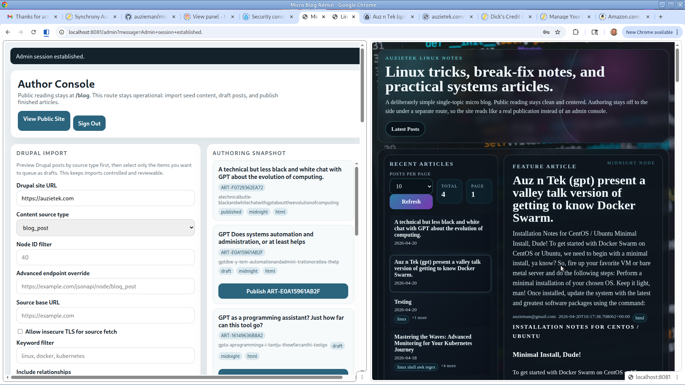
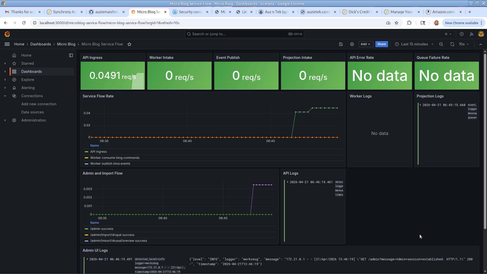
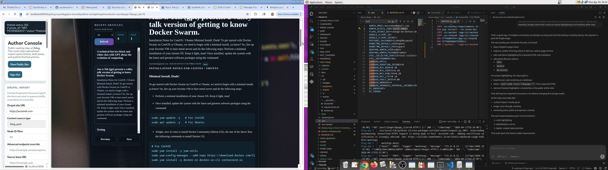

# Micro Blog

`micro-blog` is a single-admin, API-first blog platform built as a real microservice demo:

- Flask API for authoring and read access
- Python worker for markdown render, revision tracking, and publish flow
- Python projection service for the public Redis read model
- Flask UI with a simple Linux-focused blog layout
- Python load generator
- local OTEL collector, Prometheus, Grafana, Loki, and Promtail via Docker Compose

The project is intentionally narrow:

- one site
- one admin identity
- markdown-first posts
- publish workflow instead of a giant CMS surface
- import-friendly article pipeline for Drupal, WordPress, or other sources
- light presentation choices instead of a heavy theme engine

The default public theme is `midnight`.

## Release snapshot

This beta release is focused on proving the end-to-end publishing loop:

- crawler, Drupal JSON:API, and filesystem imports can stage drafts
- drafts can be promoted into the public Redis read model
- existing posts can be edited, previewed, unpublished, soft-deleted, restored, and hard-deleted
- revision snapshots, slug aliases, and re-mirror controls are in place for the single-admin workflow
- public post pages now emit sitemap, RSS, robots, canonical, Open Graph, Twitter, and JSON-LD metadata
- filesystem bootstrap sync can replay the article chain as managed demo/test content
- a small local operator helper wraps common Compose build/up/down/log flows
- imported HTML formatting is preserved well enough for real Linux notes
- multiple imported screenshots and local content assets are supported
- Grafana/Prometheus/Loki remain available for local service monitoring

Current public UI:



Monitoring option:



Recent local progress view:



Known next work:

- richer monitoring around article state, queue health, and import job status
- stronger imported image clone/repair workflow for edge-case HTML
- tighter crawler body selection for noisy legacy pages
- optional revision diff rendering instead of the current revision snapshot list
- browser smoke coverage against the live Compose stack

## Services

- `blog-api`
- `blog-worker`
- `blog-projection`
- `blog-ui`
- `loadgen`

## Local startup

```bash
cd /home/auzieman/Projects/micro-blog
docker compose build
docker compose --profile local-observability up -d
docker compose up -d
docker compose --profile load up -d loadgen
```

Endpoints:

- API: `http://localhost:8080`
- UI: `http://localhost:8081`
- RabbitMQ: `http://localhost:15672`
- Grafana: `http://localhost:3000`
- Prometheus: `http://localhost:9090`
- Loki: `http://localhost:3100`

For local public-network style testing, set in `.env` before exposing anything beyond your laptop:

- `FLASK_SECRET_KEY` to a real secret
- `ADMIN_ACCESS_CODE` to a non-default value if you are intentionally staying on local-code auth
- `SESSION_COOKIE_SECURE=true` when HTTPS is in front
- `ENABLE_HSTS=true` only when HTTPS termination is in place
- `MAX_CONTENT_LENGTH_BYTES` to a sane limit for admin form submissions
- `ADMIN_LOGIN_MAX_ATTEMPTS` and `ADMIN_LOGIN_WINDOW_SECONDS` as needed
- `SITE_URL` to the public base URL
- `GOOGLE_CLIENT_ID`, `GOOGLE_CLIENT_SECRET`, and `GOOGLE_OAUTH_REDIRECT_URI` for production admin auth
- `SITE_NAME`, `SITE_DESCRIPTION`, and `DEFAULT_OG_IMAGE` for public metadata defaults

## Admin model

Current admin identity is configured by `ADMIN_EMAIL` and defaults to:

- `auzieman@gmail.com`

The UI now supports a single-admin Google OAuth flow:

- if `GOOGLE_CLIENT_ID` and `GOOGLE_CLIENT_SECRET` are set, `/admin` requires Google sign-in
- only the configured `ADMIN_EMAIL` is accepted
- if Google OAuth vars are absent, the local code fallback remains available for local development

This intentionally does not introduce multi-user support, groups, or a CMS-style editorial model.

## Blog API

- `GET /healthz`
- `GET /readyz`
- `GET /fault-modes`
- `GET /posts?page=1&page_size=10`
- `GET /posts/all`
- `GET /posts/<slug>`
- `GET /admin/posts/<article_id>`
- `GET /admin/posts/<article_id>/revisions`
- `POST /admin/posts`
- `POST /admin/posts/preview`
- `PUT /admin/posts/<article_id>`
- `POST /admin/posts/<article_id>/publish`
- `POST /admin/posts/<article_id>/unpublish`
- `POST /admin/posts/<article_id>/delete`
- `POST /admin/posts/<article_id>/restore`
- `POST /admin/posts/<article_id>/remirror`
- `POST /admin/posts/<article_id>/hard-delete`
- `POST /admin/import-sample`
- `POST /admin/import/drupal`
- `POST /admin/import/public-crawl`
- `POST /admin/import/filesystem`
- `POST /admin/bootstrap/filesystem-sync`
- `GET /admin/posts`

Article payloads support a small publishing-oriented model:

- `title`
- `slug`
- `summary`
- `body_format` (`markdown` or `html`)
- `markdown_body`
- `hero_image_url`
- `theme_variant` (`aurora`, `paper`, `midnight`)
- `tags`
- `status`
- `seo_title`
- `seo_description`
- `canonical_url`
- `og_image_url`

Write-model behavior added in this phase:

- clean unique slug enforcement
- slug alias redirects when a published slug changes
- soft delete / restore without hard data loss
- explicit unpublish back to draft
- hard delete for permanent cleanup, with UI confirmation
- re-mirror command to republish an existing article into the public read model
- basic revision snapshots in Postgres

## Public UI routes

- `GET /blog`
- `GET /post/<slug>`
- `GET /sitemap.xml`
- `GET /robots.txt`
- `GET /rss.xml`

Public post pages now render:

- canonical, Open Graph, and Twitter card tags
- per-post SEO overrides
- JSON-LD `Article` structured data
- syntax-highlighted markdown code blocks
- slug alias redirects for old links

## Sample content

The scaffold includes a few Linux-focused sample posts in:

- [sample_posts.json](./src/api/sample_posts.json)
- [content/posts/linux](./content/posts/linux)

These are paraphrased seed articles inspired by AuzieTek Linux article titles and snippets so you have realistic starting content without copying the original posts verbatim.

## Drupal import

The API now supports a Drupal source import route:

- `POST /admin/import/drupal`

See:

- [docs/drupal-import.md](./docs/drupal-import.md)

The default parser expects Drupal JSON:API-style responses and will try these common fields automatically:

- `attributes.title`
- `attributes.body.summary`
- `attributes.body.processed`
- `attributes.body.value`
- `attributes.path.alias`
- taxonomy tags from `relationships.field_tags.data` plus `included`
- body format inferred from HTML vs raw source
- hero image resolution from `relationships.field_image`

Imported Drupal posts should usually be queued as `draft` first, reviewed, then published.

## Public crawl import

The crawler import is the pragmatic fallback for legacy sites where the public content URLs are easier to reason about than backend APIs.

The admin form accepts:

- site URL, such as `https://auzietek.com`
- listing URL, such as `https://auzietek.com/blogs`
- optional `node/##` filter
- optional keyword filter
- insecure TLS override for legacy certificate chains

The crawler previews public `node/##` pages, stages selected articles as drafts, and can localize remote image references into the mounted [`content`](./content) tree during import. Imported article HTML is rewritten toward `/content-files/...` paths so future public rendering does not depend on the original source FQDN.

## Filesystem import

The admin UI also supports previewing and importing local markdown content from the mounted [`content`](./content) directory.

Included fixtures now cover:

- simple front matter
- multiline tag lists
- hero image rewriting
- linked image rewriting
- keyword filtering for preview selection

Expected format:

- optional front matter delimited by `---`
- markdown body below it
- adjacent relative images such as `images/banner.svg`

Supported front matter keys:

- `title`
- `summary`
- `tags`
- `slug`
- `hero_image`
- `theme_variant`
- `status`

Relative image paths are rewritten to `/content-files/...` so imported markdown can keep working images without adding a full media library.

Imported HTML routes continue to work, and imported markdown now gets syntax-highlighted fenced code blocks through the worker render path.

If you want this to auto-import on local startup, set:

- `AUTO_IMPORT_FILESYSTEM_ON_BOOT=true`

## Bootstrap story sync

The filesystem-backed article chain can now act as managed bootstrap content for demos and test runs.

Use:

- `POST /admin/bootstrap/filesystem-sync`

Supported sync modes:

- `skip`: leave already-imported filesystem articles alone
- `update`: only upsert missing or changed filesystem articles
- `reset`: soft-delete matching managed filesystem articles, then re-import them

This is intended for the article chain under [`content/posts`](./content/posts) so the stack can tell its own story while also exercising the markdown/file loader repeatedly.

The admin UI exposes this as **Bootstrap Story Sync**. It only manages filesystem-origin records by their stable import article IDs, so unrelated hand-authored posts are left alone.

## Local operator helper

For local stack control, use:

- [scripts/dev_control.py](./scripts/dev_control.py)

Examples:

```bash
cd /home/auzieman/Projects/micro-blog
./scripts/dev_control.py status
./scripts/dev_control.py rebuild blog-api blog-ui blog-projection
./scripts/dev_control.py logs blog-api blog-ui
./scripts/dev_control.py load-up
```

Available commands:

- `status`
- `build`
- `up`
- `restart`
- `rebuild`
- `down`
- `core-up`
- `load-up`
- `logs`

## Tests

Focused parser/import, public metadata, and UI route tests live under [`tests`](./tests).

Run them with:

```bash
cd /home/auzieman/Projects/micro-blog
python3 -m unittest discover -s tests -p 'test_*.py'
```

On a bare host Python without Flask or OTEL deps installed, the UI route tests are skipped. Inside the service image or a fully provisioned virtualenv they run normally.

## Public hardening

Before deploying an internet-facing copy:

- replace the default admin access code and Flask secret
- front it with HTTPS and set `SESSION_COOKIE_SECURE=true`
- enable `ENABLE_HSTS=true` only once HTTPS is verified end-to-end
- keep `MAX_CONTENT_LENGTH_BYTES` small enough to avoid oversized admin submissions
- prefer Google OAuth over the local code challenge
- keep `/admin` off public navigation
- keep load generation disabled
- review imported HTML before publishing it publicly

## Scope guardrails

This project is meant to stay a dynamic publishing system, not a full CMS.

What it should do well:

- author posts
- import posts from systems like Drupal
- render a clean public reading surface
- keep API, worker, projection, and observability first-class

What it should avoid for now:

- multi-user editorial workflows
- deep media management
- block layout builders
- large plugin or theme ecosystems
